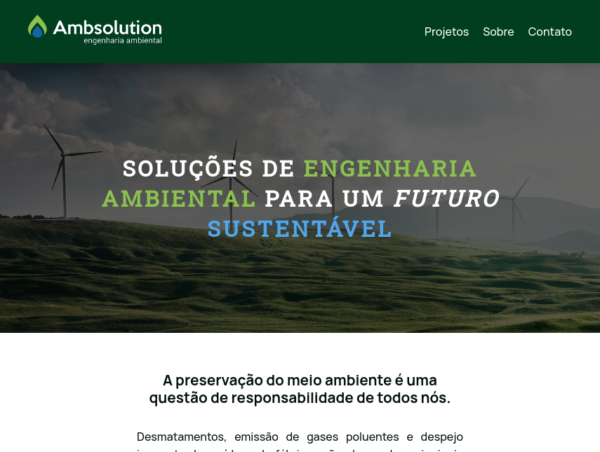

# APS
**Atividades Pŕaticas Supervisionadas** são tarefas que os alunos precisam fazer para cumprir as exigências do curso. Essas atividades podem incluir idas à biblioteca, trabalhos em grupo ou individuais, resolução de exercícios supervisionados pelos professores, trabalhos científicos e seminários. 

Durante este semestre, o nosso professor de Programação Web Responsiva propôs que desenvolvêssemos um site baseado em algum projeto sustentável utilizando HTML/CSS. O nosso grupo decidiu criar um site sobre a empresa Ambsolution, especializada em engenharia ambiental.

